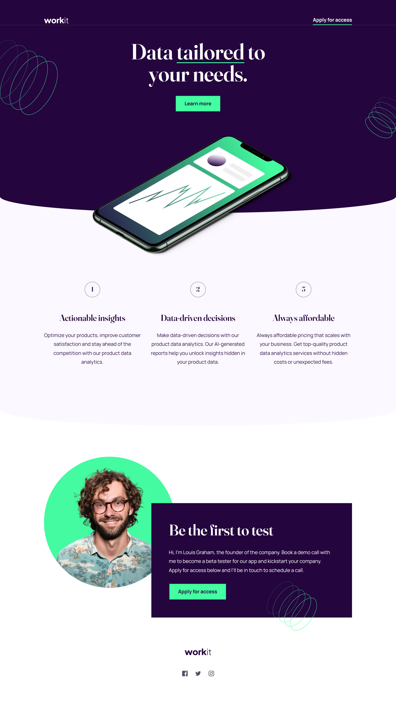

# Frontend Mentor - Workit landing page solution

This is a solution to the [Workit landing page challenge on Frontend Mentor](https://www.frontendmentor.io/challenges/workit-landing-page-2fYnyle5lu). 

## Table of contents

- [Overview](#overview)
  - [The challenge](#the-challenge)
  - [Screenshot](#screenshot)
  - [Links](#links)
- [My process](#my-process)
  - [Built with](#built-with)
- [Author](#author)

## Overview

### The challenge

Users should be able to:

- View the optimal layout for the interface depending on their device's screen size
- See hover and focus states for all interactive elements on the page

### Screenshot

### Links

- Solution URL: [GitHub](https://github.com/g-akca/workit-landing-page)
- Live Site URL: [Workit Landing Page](https://g-akca.github.io/workit-landing-page/)

## My process

### Built with

- Semantic HTML5 markup
- CSS custom properties
- Flexbox
- CSS Grid
- Mobile-first workflow
- Responsive design
- [Tailwind CSS](https://tailwindcss.com/) - CSS framework
- [React](https://reactjs.org/) - JS library

## Author

- GitHub - [@g-akca](https://github.com/g-akca)
- Frontend Mentor - [@g-akca](https://www.frontendmentor.io/profile/g-akca)